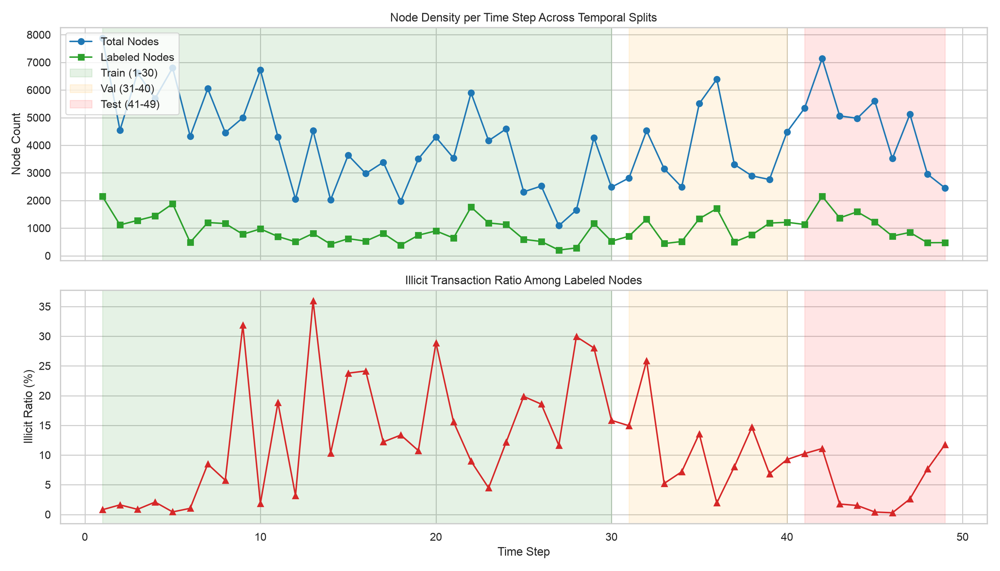
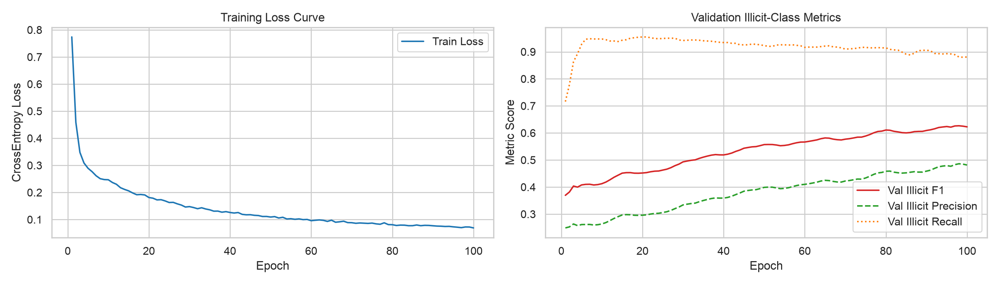
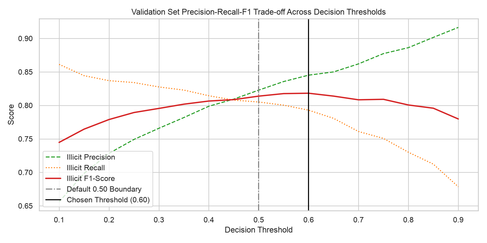

# Illicit Bitcoin Detection: Final Report

## Executive Summary

This project builds a transductive node classifier for illicit Bitcoin transaction detection on
the Elliptic Bitcoin dataset (~204K transactions, ~468K edges after preprocessing, 165
anonymized features per node), using GraphSAGE. The pipeline was built and validated in four
phases — exploratory data analysis, graph construction, a fixed-hyperparameter baseline, and a
config-driven ablation study — each gated on the one before it, with the test split sealed until
the final evaluation.

The headline, sealed-test result is **illicit-class F1 = 0.5553** (precision 0.7793, recall
0.4313), evaluated exactly once on time steps 41–49. This is reported alongside the validation
result used for model selection (F1 0.8182) rather than in place of it, because the gap between
them, and its most likely cause, is itself one of this project's findings: a real temporal shift
in class distribution between the validation and test periods, compounded by the risk inherent
in selecting a configuration through repeated comparisons against a single, moderately sized
validation split. Disclosing that gap, rather than reporting only the more favorable validation
number, is a deliberate methodological choice, consistent with this project's no-placeholder-
metrics principle.

---

## 1. Problem and Data

The Elliptic Bitcoin dataset represents Bitcoin transactions as nodes in a directed graph, with
edges encoding payment flow. Each node carries 165 features (a mix of local transaction
statistics and neighbor-aggregated statistics) and one of three labels: illicit, licit, or
unknown. Only 22.85% of nodes are labeled; of those, illicit transactions are a small minority
(9.76%).

Verified integrity checks (Phase 0) confirmed the raw files match their documented statistics
exactly: 203,769 nodes, 234,355 directed edges, 165 features, zero missing values, zero
duplicate or self-loop edges, zero orphaned edge endpoints.

**Class distribution.** Overall: 77.15% unknown, 20.62% licit, 2.23% illicit. Within the labeled
subset: 90.24% licit, 9.76% illicit.

**Temporal structure.** The dataset spans 49 discrete time steps, used as the basis for a
temporal (not random) train/validation/test split: steps 1–30 (train, 26,905 labeled nodes),
31–40 (validation, 9,686 labeled nodes), 41–49 (test, 9,973 labeled nodes). The illicit ratio
among labeled nodes varies from under 1% to approximately 36% across time steps, direct evidence
of population drift that motivates the temporal split and, as discussed in Section 5, turns out
to materially affect the final result.

**Structural property confirmed in Phase 1:** zero of the 234,355 directed edges connect nodes
in different time steps. Each time step is an isolated, disconnected temporal subgraph. This
limits, though does not eliminate, the leakage surface of including unlabeled nodes in
message-passing: there is no graph-topology path by which test-period structure could influence
train-period node embeddings.

### 1.1 Data Provenance and a Disclosed Dataset Limitation

Cross-referencing the original dataset publication (Weber et al., 2019) and a 2026
reproducibility study (Šafář, Pluskal, Veselý & Ryšavý, *"The enemy of reproducibility is
opacity: What's inside the Elliptic Bitcoin dataset (and why it is wrong)"*, Forensic Science
International: Digital Investigation, 57, 302124) established two facts not derivable from the
dataset's files alone:

1. All features except `time_step` are already z-score standardized (zero mean, unit variance)
   by the dataset creators prior to release.
2. A subset of the released aggregated features — specifically address-scoped statistics — are
   computed relative to a single fixed reference point, Bitcoin block height 575,059, rather
   than to each transaction's own point in time. Because this reference point is identical
   across all 49 time steps, it introduces a temporal leakage that is baked into the released
   dataset itself, upstream of any decision made in this project. This cannot be corrected
   without access to the original unprocessed blockchain data, which was never published. It is
   disclosed here for methodological transparency: any result reported on this benchmark,
   including this project's, inherits this known characteristic of the dataset.

---

## 2. Graph Construction

Raw transaction IDs were remapped to a contiguous zero-based index space (persisted at
`data/processed/node_id_mapping.csv`) for compatibility with PyTorch Geometric. The directed
edge list was converted to undirected (468,710 edges, exactly double the original 234,355 —
consistent with Phase 0's finding of zero pre-existing duplicate or reciprocal edges), justified
by the classification task needing information from both incoming and outgoing transaction flow,
not just payment direction.

The resulting `Data` object (`x`: [203769, 165], `edge_index`: [2, 468710], `y`: [203769],
plus `train_mask`/`val_mask`/`test_mask`) was validated structurally (bounds checks, mask
mutual-exclusivity, no unknown-labeled nodes in any loss-contributing mask) and persisted with a
verified save/reload roundtrip.

---

## 3. Baseline (Phase 2)

A fixed, non-tuned 2-layer GraphSAGE baseline (`SAGEConv(165, 64) → ReLU → Dropout(0.5) →
SAGEConv(64, 2)`, mean aggregation, Adam optimizer) was trained for 100 epochs with
inverse-frequency class weighting (8.11× illicit-to-licit ratio, computed strictly from
`train_mask`) to establish pipeline correctness before any hyperparameter search.

**A bug was found and fixed during this phase:** validation metrics were originally computed
from a forward pass still carrying active dropout (computed while the model was in `train()`
mode), rather than a clean `eval()`-mode pass, corrupting both the tracked learning curve and
the best-checkpoint selection criterion. The fix — a dedicated eval-mode forward pass — is
confirmed correct by an order-of-magnitude reduction in the discrepancy between the last logged
epoch's F1 and the reloaded checkpoint's F1 (0.03 before the fix, 0.004 after).

**Baseline validation result:** illicit-class precision 0.4863, recall 0.8810, F1 0.6267.

---

## 4. Config-Driven Ablation (Phase 3)

Five open design decisions were resolved through single-axis-at-a-time ablation (each axis
varied independently against the Phase 2 baseline settings, then combined): this trades the
ability to detect interaction effects between axes for a result set in which every reported
difference has one clear, attributable cause. All ablation was run against `val_mask` only.

| Axis | Baseline | Candidates tested | Winner | Val F1 |
|---|---|---|---|---|
| Feature scaling | none | RobustScaler (train-fit) | **none** | 0.6267 vs. 0.4980 |
| Hidden channels | 64 | 32, 128 | **128** | 0.6749 |
| Num. layers | 2 | 3 | **3** | 0.7031 |
| Dropout | 0.5 | 0.3, 0.7 | **0.3** | 0.6582 |
| Class weighting | inverse (8.11×) | none, sqrt-inverse | **none** | 0.8138 (controlled) |
| Decision threshold | 0.50 | 0.10–0.90 sweep | **0.60** | 0.8182 |

**Additional scaling degraded performance** (F1 0.4980 vs. 0.6267), consistent with the Section
1.1 finding that the features are already standardized; a second scaling pass appears to distort
rather than improve the distribution.

**Architecture changes each individually improved F1** when varied against the baseline
(deeper, wider, lighter dropout), with the layer-count change contributing the largest single
gain (+0.0764).

**A methodological confound was found and corrected during the class-weighting ablation.** The
initial comparison evaluated unweighted and sqrt-inverse-weighted models using the *new*
winning architecture from the previous step, but compared them against the Phase 2 baseline's
`inverse`-weighted result, which used the *original* architecture — mixing two variables in one
comparison. This was caught before proceeding, and a controlled run (inverse weighting on the
*same* winning architecture) was added: F1 0.7040, versus the uncontrolled comparison's
unweighted result of 0.8138. With the confound removed, unweighted loss remains the genuine
winner for this axis, by a real margin (+0.1098 over the controlled inverse-weighting run) — but
the finding is now attributable to the weighting choice alone, not entangled with the
architecture change. This correction, not just the final numbers, is itself evidence of the
auditing discipline this project is built to demonstrate.

**The decision threshold sweep was a secondary refinement**, not a major contributor: the
precision-recall curve was relatively flat across the 0.45–0.65 range, and the F1-optimal
threshold of 0.60 improved on the default 0.50 boundary only modestly (0.8182 vs. 0.8138).

**Final locked configuration:** no additional scaling, `hidden_channels=128`, `num_layers=3`,
`dropout=0.3`, unweighted loss, decision threshold 0.60. This combination was retrained once as
a confirmation run before the sealed test was touched; given fixed-seed, full-batch, CPU-only
training, this run reproduced the ablation result exactly (F1 0.8182) — this confirms the
save/reload artifact chain, not the configuration's stability under stochastic variation, and is
reported as such rather than overstated as independent validation.

---

## 5. Sealed Test Result and Honest Disclosure of the Validation–Test Gap

The final locked configuration was evaluated against the test split (time steps 41–49) exactly
once, as the project's headline metric:

| Metric | Validation | Sealed Test |
|---|---|---|
| Precision (illicit) | 0.8452 | 0.7793 |
| Recall (illicit) | 0.7929 | 0.4313 |
| F1 (illicit) | 0.8182 | **0.5553** |

**Confusion matrix (test):** TN 9,385, FP 64, FN 298, TP 226.

This is a substantial drop from the validation result, driven almost entirely by a recall
collapse (0.7929 → 0.4313) while precision held up comparatively well (0.8452 → 0.7793). Two
non-exclusive, identified causes:

1. **Real temporal distribution shift.** The test split's illicit prevalence is 5.25% (524 of
   9,973 labeled nodes), roughly half the validation split's 11.02% (1,067 of 9,686), consistent
   with the population drift already documented in Section 1. The unweighted loss selected in
   Phase 3 was the genuine winner against validation's specific class balance, but an unweighted
   model is, by construction, more biased toward the majority class than a weighted one; against
   a test period that is proportionally even more licit-dominated, that bias increases, and
   recall pays the price.
2. **Repeated validation-based model selection.** Roughly a dozen distinct trained
   configurations, plus a 17-point threshold sweep, were all evaluated against the same
   9,686-node validation split over the course of this notebook. Selecting the best result
   across that many comparisons against a fixed, moderately sized validation set carries a known
   risk that the selected configuration's validation score is optimistically biased relative to
   its true generalization performance, independent of any temporal drift. The sealed test
   result is the only estimate in this project not subject to that selection bias.

This gap is reported as a finding, not hidden as an inconvenience: it demonstrates, concretely,
why sealed-test discipline and temporal (rather than random) splitting matter in a real
deployment setting, where the population a model sees in production can differ from the
population it was validated against.

---

## 6. Reproducibility

All hyperparameters and resolved design decisions are recorded in `configs/config.yaml`, with
inline comments documenting when and why each value was decided; no value used in the final
configuration is hardcoded outside that file. Random seed fixed at 42 throughout; training is
CPU-only, full-batch, and deterministic given a fixed seed. Every persisted artifact (node ID
mapping, graph `Data` object, model checkpoints) was verified via a save/reload roundtrip check
before being trusted by a downstream notebook.

## 7. Limitations and Candidate Future Work

- The fixed-reference-block leakage documented in Section 1.1 is a property of the released
  benchmark itself and was not, and could not be, corrected in this project.
- Single-axis-at-a-time ablation does not test interaction effects between axes; the final
  configuration's individual axis wins are not guaranteed to be jointly optimal.
- No genuine stochastic stability check (e.g., re-running the final configuration under multiple
  random seeds) was performed; the Section 4 "confirmation run" was deterministic by
  construction and does not substitute for one.
- A class-weighted variant of the final architecture, specifically evaluated for robustness to
  the test period's lower illicit prevalence, was identified as valuable follow-up work but was
  out of scope for this phase, since it would require a new, separately disclosed experiment
  rather than a revision of the sealed test result reported above.
